<script type="text/javascript" src="http://cdn.mathjax.org/mathjax/latest/MathJax.js?config=TeX-AMS-MML_HTMLorMML"></script>
<script type="text/x-mathjax-config">
    MathJax.Hub.Config({ tex2jax: {inlineMath: [['$', '$']]}, messageStyle: "none" });
</script>

## 第一讲绪论

🫶🏻 **Author:何柯💗**  🫶🏻

### 一、算法的时间复杂度分析
定义：对于程序大致运行时间的描述

**1.单循环**

解题方式：写出次数和条件值即可

```cpp
int i=0;
while(i*i*i<=n)
{
    i++;
}
```

| 次数 | 0 | 1 | 2 | ... | k |
| :-- | :--: | :--: | :--: | :--: | :--: |
| 条件 | $0^3 \le n$ | $1^3 \le n$ | $2^3 \le n$ | ... | $k^3 \le n$ |

$$k^3<n$$

```cpp
int x=0;
while(n>=(x+1)*x+1)
{
    i++;
}
```
| 次数 | 0 | 1 | 2 | ... | k |
| :-- | :--: | :--: | :--: | :--: | :--: |
| 条件 |1 | $2^2$ | $3^2$ | ... | $(k+1)^2$ |

$$(k+1)^2=n$$

**2.双循环**

当**外层不影响内层**的情况，当成两次单循环即可:
```cpp
int x=0;
for(int k=1;k<=n;k*=2)
{
    for(int j=1;j<=n;j++)
    {
        x++;
    }
}
```
算出两个复杂度内外循环相乘

当**外层会影响内层**时候:
```cpp
int m=0.i.j
for(int i=0;i<=n;i++)
{
    for(int j=1;j<=2*i;j++)
    {
        m++
    }
}
```
$$T(n) = \sum_{i=1}^{n} \sum_{j=1}^{2i} 1$$
原理如下(其实就是吧i,j,内层执行次数写出来然后对齐求和)：
| 外层 i | 内层 j 范围 | 内层执行次数 | m 的累加过程 |
| :--- | :--- | :---: | :--- |
| 0 | 1 到 0 (不成立) | 0 | m = 0 |
| 1 | 1 到 2 | 2 | m = 0 + 2 |
| 2 | 1 到 4 | 4 | m = 0 + 2 + 4 |
| ... | ... | ... | ... |
| n | 1 到 2n | 2n | m = 2 + 4 + ... + 2n |

扩展：

```cpp
int m=0;
for(int i=0;i<=n;i++)
{
    for(int j=1;j<=2*i;j++)
    {
        for(int k=1;k<=j;k++)
            m++
    }
}
```
$$T(n) = \sum_{i=1}^{n} \sum_{j=1}^{2i}\sum_{k=1}^{j} 1$$


### 二、算法的空间复杂度分析

**1. 固定空间型（常数阶 ）**

这种题型中，无论输入数据规模  多大，算法分配的变量个数都是固定的。

* **特征**：只定义了几个简单的临时变量（如 `i`, `j`, `temp`, `sum`）。
* **示例**：
```cpp
int sum = 0;
for(int i = 0; i < n; i++) {
    sum += i;
}

```
* **解题**：空间复杂度为O(1) 。

**2. 线性空间型（线性阶 ）**

算法内部定义了与输入规模  成正比的存储结构。

* **特征**：定义了数组、链表、栈或队列，且其长度取决于 。
* **示例**：
```cpp
int* arr = new int[n]; // 分配了n个大小的空间
for(int i = 0; i < n; i++) arr[i] = i;

```


* **解题**：空间复杂度为 。如果定义的是二维数组 `new int[n][n]`，则为O(n) 。

**3. 递归空间型**

这是考试中最容易出错的类型。递归不仅看代码里有没有定义变量，还要看**递归调用的深度**（即系统栈占用的空间）。

* **特征**：函数自我调用。
* **计算公式**：**空间复杂度 = 递归深度*每次递归调用的局部变量空间**。
* **示例 A（普通递归）**：
```cpp
void print(int n) {
    if (n <= 0) return;
    print(n - 1);
}

```
递归深度为n ，每次调用只占用常数空间，故为O(n) 。

**解题方法归纳**

在分析空间复杂度时，可以套用以下步骤：

| 步骤 | 操作方法 |
| --- | --- |
| **第一步：找存储变量** | 检查代码中是否有 `new`, `malloc` 或直接定义的数组、集合。如果有，看其大小是否随  变化。 |
| **第二步：判定递归深度** | 如果有递归，画出递归树，确定从根到叶子的最长路径长度（深度）。 |
| **第三步：忽略辅助开销** | 算法的空间复杂度只考虑**为实现算法而额外开辟的空间**，输入数据本身占用的空间不计入。 |
| **第四步：取最高阶** | 和时间复杂度一样，保留最高阶项，忽略常数系数。 |

---

## 第三讲栈和队列

### 一、出栈可能计算公式

$$ \frac{1}{n+1} C_{2n}^{n} $$
又叫做卡特兰数

### 二、非循环队列和循环队列

| 特性 | 非循环队列（普通顺序队列） | 循环队列 (推荐) |
| :--- | :--- | :--- |
| **空间利用率** | **低**。会产生“假溢出”，出队后的空间无法重复利用。 | **高**。通过数学取模逻辑，使空间首尾相接循环利用。 |
| **指针更新** | `ptr++` | `ptr = (ptr + 1) % MaxSize` |
| **队满判定** | `rear == MaxSize - 1` | `(rear + 1) % MaxSize == front` |
| **队空判定** | `front == rear` | `front == rear` |

---

## 第四讲串

### 一、子串

个数计算公式 $\frac{n(n+1)}{2} + 1$

原理：空 1 ，本身 1 ，接下来就是 2， 3， 4....n-1(随长度递减)

### 二、串的模式匹配

**1. BF算法**

将目标串 $S$ 的第一个字符与模式串 $T$ 的第一个字符进行比较 2。若相等，则继续比较后续字符；若不等，则目标串 $S$ 回退到本趟开始字符的下一个字符，模式串 $T$ 回退到开头，重新开始下一趟匹配 3。

```cpp
int BF(string s, string t) {
    int i = 0, j = 0; // i 指向目标串 s，j 指向模式串 t
    
    // 当两串均未遍历完时进行循环
    while (i < s.length() && j < t.length()) {
        if (s[i] == t[j]) { // 比较的两个字符相同时
            i++;            // s 和 t 指针同时后移
            j++; 
        } 
        else {              // 比较的两个字符不同时（失配）
            i = i - j + 1;  // i 回退到本趟开始位置的下一个字符
            j = 0;          // j 移动到模式串 t 的开头
        }
    }
    
    // 如果 j 遍历完了模式串，说明匹配成功 
    if (j >= t.length()) 
        return i - t.length(); // 返回模式串在目标串中的起始位置 
    else 
        return -1;             // 匹配不成功，返回 -1 
}
```
理解$i = i - j + 1$ 其中 $(i - j)$是计算出当前这一趟匹配是从主串的哪个位置开始的。 如果你已经在这一趟匹配中对比了 $j$ 个字符，那么主串的起始点就是当前位置 $i$ 减去移动的距离 $j$,因为j会被置为0。

**2.KMP算法**

在BF算法中，一旦失配，主串指针 $i$ 会退回并重新开始，这造成了大量重复比较 。KMP认为：已经匹配成功的那些字符包含了重要的信息 。如果模式串的前缀和失配位置之前的后缀有重合部分，我们就可以直接把模式串“滑”过去，跳过肯定不匹配的步骤。于是该操作的核心就是维护了一个next数组，我们先来看看什么是next数组

**next数组**：next[j]就是说当模式串中的第 $j$ 个字符发生失配时，模式串应该回退到的新位置，不像BF算法直接回退到开头了

知道next数组之后我们来聊一下他的**求解逻辑**：

对于模式串 $t$，next[j] 的值取决于子串 $t[0 \dots j-1]$ 中最长的相等前后缀的长度。
特殊规定next[0] = -1：表示第 0 个字符就匹配失败，主串指针 $i$ 需后移。 next[1] = 0：表示第 1 个字符匹配失败，只能回退到第 0 个字符重新比

我们不是独立计算每个 next[j]，而是利用 next[j] 来推导 next[j+1]，假设已知 next[j] = k，这意味着 $t[0 \dots k-1] = t[j-k \dots j-1]$

于是我们就考虑如下两种情况：

情况 A：字符匹配成功如果 $t[j] == t[k]$： 既然前面的部分已经相等，现在末尾又加了一个相等的字符，那么相等的前后缀长度就增加了   **结论：next[j+1] = k + 1。**

情况 B：字符匹配失败如果 $t[j] \neq t[k]$：说明当前的公共前后缀无法延续。我们需要找一个更短的公共前后缀。 操作：令 k = next[k]。 逻辑：这相当于把模式串相对于自己进行了一次 KMP 跳转，一直回退到某个能匹配上 $t[j]$ 的位置，或者回退到 -1 为止。

```cpp
void GetNext(string t, int* next) {
    int j = 0;      // j 指向当前正在计算的位置
    int k = -1;     // k 代表最长公共前后缀的长度
    next[0] = -1;   // 固定初始值 

    while (j < t.length() - 1) { // 遍历模式串 
        // k == -1 代表需要重新开始，或者当前字符匹配成功 
        if (k == -1 || t[j] == t[k]) {
            j++; 
            k++;
            next[j] = k; // 成功递推：next[j+1] = k+1 
        } 
        else {
            k = next[k]; // 失败回退：寻找更短的公共前后缀 [
        }
    }
}
```

以模式串 `t = "abcac"` 为例，其 `next` 数组的推导过程如下：

| $j$ | $t[j]$ | $t[j]$ 前面的子串 | 相等前后缀情况 | `next[j]` |
| :--- | :--- | :--- | :--- | :--- |
| 0 | a | 无 | 无 | **-1** |
| 1 | b | "a" | 无 | **0** |
| 2 | c | "ab" | 无 | **0** |
| 3 | a | "abc" | 无 | **0** |
| 4 | c | "abca" | "a" == "a" (长度为1) | **1** |

```cpp
int KMP(string s, string t) {
    int n = s.length(), m = t.length();
    int* next = new int[m];
    GetNext(t, next); // 1. 预计算局部匹配信息 next 数组 
    
    int i = 0, j = 0; // i 指向主串，j 指向模式串 
    while (i < n && j < m) { // 两串均未遍历完时循环 
        // j == -1（对应next[0]）或当前字符匹配成功 
        if (j == -1 || s[i] == t[j]) {
            i++; 
            j++; // 指针双双后移 
        } 
        else {
            j = next[j]; // 失配：i 不变，j 根据 next 数组回退 
        }
    }
    
    if (j >= m) return i - m; // 匹配成功：返回起始位置 
    else return -1;           // 匹配失败：返回 -1 
}
```

**3.改进的KMP算法**

其实就是改变了next数组的求法，它消除了模式串中连续重复字符带来的无效匹配尝试，使跳转更加彻底。

```cpp
void GetNextval(string t, int* nextval) {
    int j = 0, k = -1;
    nextval[0] = -1; // 初始规定 
    
    while (j < t.length() - 1) {
        if (k == -1 || t[j] == t[k]) { // 字符匹配成功
            j++; k++;
            if (t[j] != t[k]) 
                nextval[j] = k;      // 情况1：字符不同，正常记录 
            else 
                nextval[j] = nextval[k]; // 情况2：字符相同，直接继承之前的回退位 
        } 
        else {
            k = nextval[k]; // 字符不匹配，k 回退 
        }
    }
}
```

**邪修求法(选择题)：**

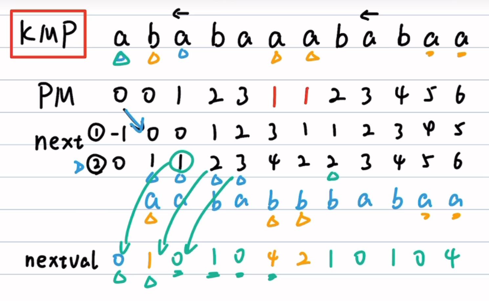

写出next数组后，全加1从1->2，得到next2

之后写出每个数字对应位数的字母

再接下来和原来字符串比对，如果不同，则照搬next2数组数值，nextval[0]=0。

最后开始写nextval数组，根据next2数值，去找nextval已有结果比如`nextval[k]=nextval[next2[k]-1]`


## 第五讲数组和稀疏矩阵

### **按行优先存储**
在 $m$ 行 $n$ 列的二维数组 $A_{m \times n}$ 中

假设每个元素占k个存储单元，LOC(a0，0)表示a0，0元素的存储地址。对于元素$a_{ij}$
元素 $a_{i,j}$ 前面有从第 $0$ 到 $i-1$ 共 $i$ 个完整行，每行有 $n$ 个元素，总计 $i \times n$ 个元素 3。

$LOC(a_{ij})=LOC(a_{00}) + (i×n + j)×k$

### **按列优先存储**

$$LOC(a_{i,j}) = LOC(a_{0,0}) + (j \times m + i) \times k$$

用如上公式计算的时候要注意**起始位置**

### **特殊矩阵的压缩存储**

**压缩存储**：若多个数据元素的值都相同，则只分配一个元素值的存储空间，且零元素不占存储空间(对称矩阵，对角矩阵，三角矩阵，稀疏矩阵等)

**1. 对称矩阵的压缩存储**
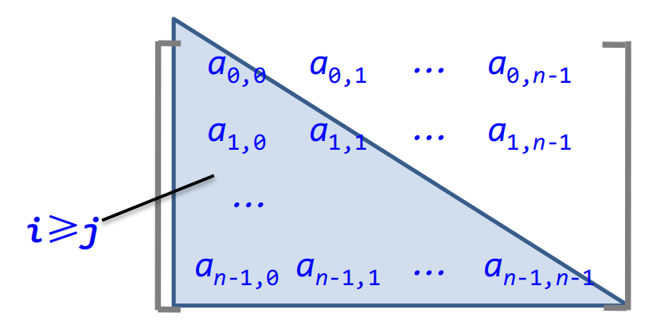

若一个 $n$ 阶方阵 $A$ 的元素满足 $a_{i,j} = a_{j,i}$ ($0 \le i, j \le n-1$)，则称其为 **$n$ 阶对称矩阵** 。

假设一维数组 $B$ 的下标 $k$ 从 $0$ 开始（即 $B[0..n(n+1)/2-1]$），则矩阵元素 $a_{i,j}$ 在 $B$ 中的位置 $k$ 为 ：

$$
k = \begin{cases} 
\frac{i(i+1)}{2} + j, & \text{当 } i \ge j \text{ 时 (下三角元素)} \\ 
\frac{j(j+1)}{2} + i, & \text{当 } i < j \text{ 时 (上三角元素)} 
\end{cases}
$$

**公式推导（$i \ge j$ 情况）**：
- 在 $a_{i,j}$ 所在的第 $i$ 行之前，共有 $i$ 行（从第 $0$ 行到第 $i-1$ 行） 
- 第 $0$ 行存 $1$ 个元素，第 $1$ 行存 $2$ 个，...，第 $i-1$ 行存 $i$ 个。前 $i$ 行总元素个数为 $1+2+\dots+i = \frac{i(i+1)}{2}$ 
- 在第 $i$ 行中，$a_{i,j}$ 之前有 $j$ 个元素（下标从 $0$ 到 $j-1$）。
- 因此，$a_{i,j}$ 是第 $\frac{i(i+1)}{2} + j$ 个元素

* **随机存取**：即使经过压缩，通过下标变换公式仍可在 $O(1)$ 时间内定位元素，保留了随机存取特性 
* **应用**：在程序中通过 `getk(i, j)` 函数实现二维坐标到一维下标的转换，从而直接对压缩后的数组进行运算（如矩阵乘法） 

**2. 上三角矩阵的压缩存储**

它的下三角(不包括主角线)中的元素均为常数c。

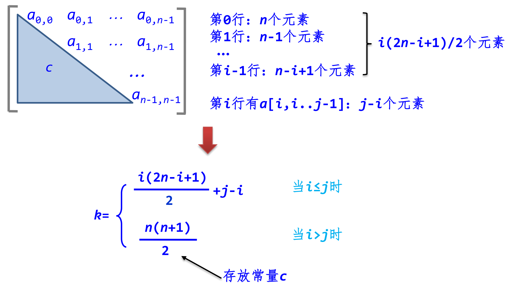


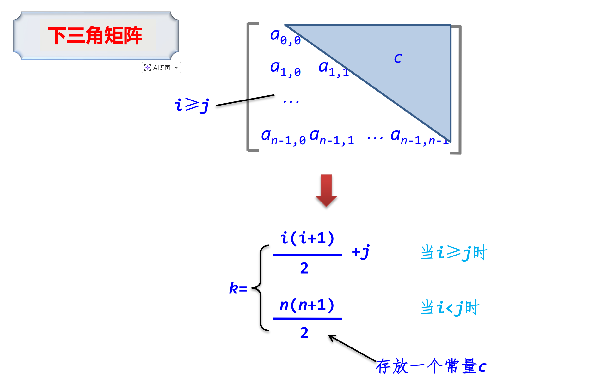

**3. 稀疏矩阵的压缩存储**

**三元组表示法：**
稀疏矩阵中的每一个非零元素需由一个三元组$(i, j, a_{ij})$

**十字链表示法：**
每行的所有结点链起来构成一个带行头结点的循环单链表。以h[i]（0≤i≤m-1）作为第i行的头结点
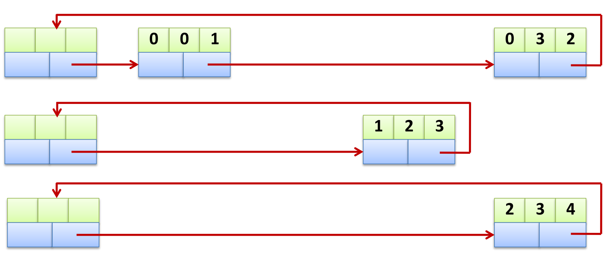

每列的所有结点链起来构成一个带列头结点的循环单链表。以h[i]（0≤i≤m-1）作为第i列的头结点
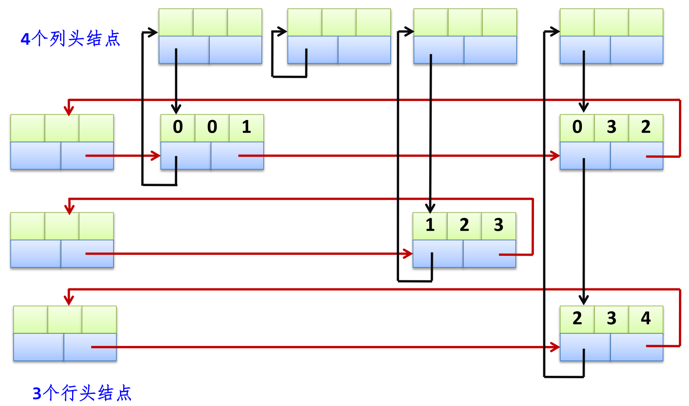

结点设计方法：

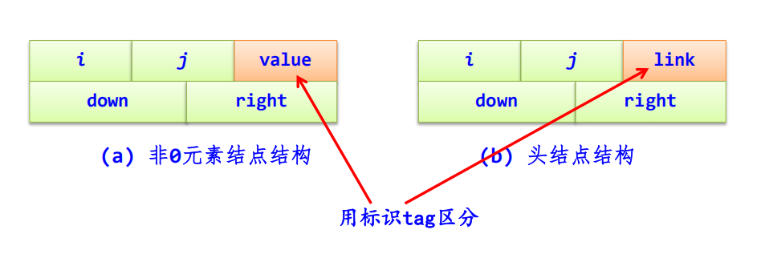

## 第七讲树和二叉树

### 与树相关的数学性质(结点数，边数，度数，高度)

- $\text{分支数}=n-1$
- $n = \sum (\text{所有节点的度}) + 1$ (这里是出度)
- $\text{分支数}=\text{度之和}$
- 度为m的树中第i层上至多$m^{i-1}$个结点
- 高度为h的m次树至多有$\frac{m^h-1}{m-1}$个结

推导：因为第i层最多有$m^{i-1}$个结点，于是就是
$$\sum_{i=1}^{h} m^{i-1} = m^0 + m^1 + m^2 + \dots + m^{h-1} = \frac{1 \times (m^h - 1)}{m - 1} = \frac{m^h - 1}{m - 1}$$

- 具有n个结点的m次数的最小高度为$\log_m(n(m-1)+1)$

推导：设具有n个结点的m次树的最小高度为h，若在该树中前h-1层都是满的那么第h层可能满也可能不满于是
$$\frac{m^{h-1}-1}{m-1} \le n < \frac{m^h-1}{m-1}$$
求解得到
$$\log_m(n(m-1)+1) ≤ h <\log_m(n(m-1)+1)+1$$

因h只能取整数,所以$h=\log_m(n(m-1)+1)$

### 二叉树相关性质

**满二叉树：**
如果所有分支结点都有左孩子结点和右孩子结点，并且叶子结点都集中在二叉树的最下一层

- 叶子结点都在最下一层
- 只有度为0和度为2的结点
- 含n个结点的满二叉树的高度为$\log_2(n+1)$

**完全二叉树：**
若二叉树中最多只有最下面两层的结点的度数可以小于2，并且最下面一层的叶子结点都依次排列在该层最左边的位置上

当完全二叉树按**层序编号后**有如下性质(假设**根节点编号为1**):

- 最后一个分支结点编号为$\frac{n}{2}$
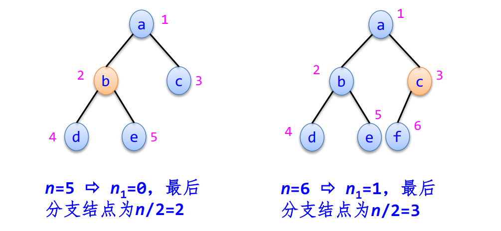
- 若n为奇数，则$n_1=0$,每个分支结点都是双分支结点,相反若n为偶数，则只有一个单分支结点
- 若编号为i的结点有左孩子结点，则左孩子结点的编号为2i；若编号为i的结点有右孩子结点，则右孩子结点的编号为2i+1
- 若编号为i的结点有左兄弟结点，左兄弟结点的编号为i-1，若有右兄弟结点，右兄弟结点的编号为i+1
- 若编号为i的结点有双亲结点，其双亲结点的编号为[i/2]。
- 具有n个（n＞0）结点的完全二叉树的高度为$\log_2(n+1)$或$\log_2(n)+1$

**二叉树：**
- 叶子结点（没有孩子的结点）的数量，永远比双分支结点（有两个孩子的结点）的数量多一个

推导：总结点数$n=n_0+n_1+n_2$。,有因为总的度数=总分支数=n-1，于是 $n_0=n_2+1$

- 非空二叉树上第i层上至多有$2^{i-1}个$结点
- 高度为h的二叉树至多有$2^h-1$个结点

### 二叉树的遍历

1. 先序遍历:
```cpp
void PreOrder11(BTNode* b) //被PreOrder函数调用
{ 
    if (b!=NULL)
    { 
        cout << b->data; //访问根结点
        PreOrder11(b->lchild); //先序遍历左子树
        PreOrder11(b->rchild); //先序遍历右子树
    }
}
void PreOrder1(BTree& bt) //先序遍历的递归算法
{
    PreOrder11(bt.r);
}
```    
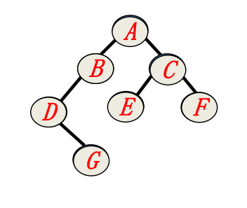

访问顺序：ABDGCEF

2. 中序遍历
```cpp
void InOrder11(BTNode* b) 
{ 
    if (b!=NULL)
    { 
        InOrder11(b->lchild); 
        cout << b->data; 
        InOrder11(b->rchild); 
    }
}
void InOrder1(BTree& bt)
{
    InOrder11(bt.r);
}
```
访问顺序：DGBAECF  

3. 后序遍历
```cpp
void PostOrder11(BTNode* b) 
{ 
    if (b!=NULL)
    { 
        PostOrder11(b->lchild); 
        PostOrder11(b->rchild);
        cout << b->data;  
    }
}
void PostOrder1(BTree& bt)
{
    PostOrder11(bt.r);
}
```
访问顺序：GDBEFCA

4. 层次遍历
```cpp
void LevelOrder(BTree& bt) //二叉树的层次遍历
{ 
    BTNode* p;
    queue<BTNode*> qu; //定义一个队列
    qu.push(bt.r); //根结点r进队
    while (!qu.empty()) //队不空时循环
    { 
        p=qu.front(); qu.pop(); //出队结点p 
        cout << p->data; //访问结点p
        if (p->lchild!=NULL) //有左孩子时将其进队
        qu.push(p->lchild);
        if (p->rchild!=NULL) //有右孩子时将其进队
        qu.push(p->rchild);
    }
}
```

### 线索二叉树

对于具有n个节点的二叉树，采用二叉链存储结构时，每个节点有两个指针域，总共有2n个指针域，又由于只有n-1个节点被有效指针所指向（n个节点中只有树根节点没有被有效指针域所指向），则共有2n-(n-1)=n+1个空链域

利用这些空链域存放在某种遍历次序下该结点的前驱结点和后继结点的指针，这些指针称为线索，加上线索的二叉树称为**线索二叉树**，分为前，中，后序二叉树

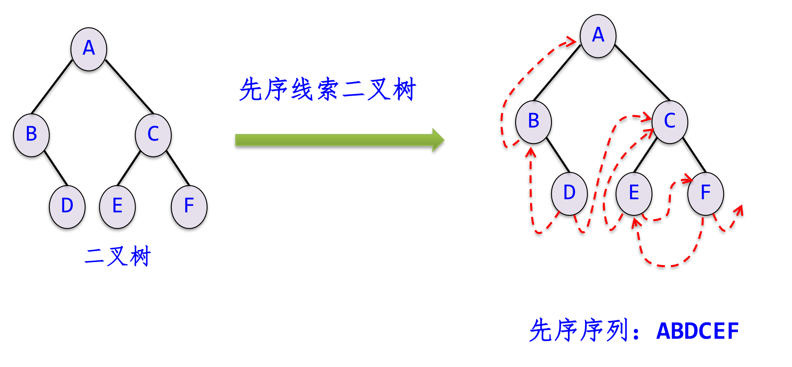

Node结构变为
```cpp
struct BthNode
{
    char data;
    BthNode* lchild,*rchild;
    int ltag,rtag; // 0表示指向孩子，1表示指向线索 （让指针指向结点前驱和后继结点）
}
```
线索化的过程如下(中序)
```cpp
void Thread(BthNode*& p) {
    if (p != NULL) {
        // 1. 递归线索化左子树
        Thread(p->lchild); 

        // 2. 处理当前结点 p 的前驱线索 (p 的左指针)
        if (p->lchild == NULL) { 
            p->lchild = pre;  // 让左指针指向前驱 pre
            p->ltag = 1;      // 修改标志，表示这是线索
        } else {
            p->ltag = 0;      // 否则是孩子
        }

        // 3. 处理前驱结点 pre 的后继线索 (pre 的右指针)
        // 注意：我们是在访问 p 时，去设置 pre 的后继指向 p
        if (pre->rchild == NULL) {
            pre->rchild = p;  // pre 的右指针指向当前结点 p
            pre->rtag = 1;    // 修改标志
        } else {
            pre->rtag = 0;
        }

        // 4. 更新 pre，当前结点处理完，成为下一个结点的前驱
        pre = p; 

        // 5. 递归线索化右子树
        Thread(p->rchild); 
    }
}
```
并且为了方便遍历，我们通常会增加一个头节点(方便得到r的pre)
```cpp
void CreateThread() {
    root = new BthNode();   // 创建头结点
    root->ltag = 0; 
    root->rtag = 1; 
    root->rchild = root;    // 右指针回指自己（初始化）

    if (r == NULL) {        // 如果是空树
        root->lchild = root; 
    } else {
        root->lchild = r;   // 左孩子指向二叉树的根
        pre = root;         // 初始化 pre 指向头结点
        
        Thread(r);          // ！！！开始递归线索化！！！
        
        // 处理遍历完后的最后一个结点
        pre->rchild = root; // 最后一个结点的后继指向头结点
        pre->rtag = 1;
        root->rchild = pre; // 头结点的右线索指向最后一个结点
    }
}
```

### 哈夫曼树
一棵二叉树树中所有叶子结点的带权路径长度之和称为该树的带权路径长 （结点值x根结点到该点的路径长度）
$$WPL = \sum_{i=1}^{n_0} w_i \times l_i$$
在$n_0$个带权叶子结点构成的所有二叉树中，带权路径长度WPL最小的二叉树称为哈夫曼树

**构造方法：**

*step* 1. 森林初始化：
将给定的 $n$ 个权值 $\{w_1, w_2, ..., w_n\}$ 看作是 $n$ 棵二叉树的森林 $F = \{T_1, T_2, ..., T_n\}$。此时，每棵树 $T_i$ 仅包含一个根节点，其权值为 $w_i$，且左右子树均为空。

*step* 2.选取与合并：
在森林 $F$ 中选取两棵根节点权值最小的树作为左、右子树，构造一棵新的二叉树。新二叉树根节点的权值等于这两棵子树根节点的权值之和。此操作称为“合并”。

由于哈夫曼树每次操作都是合并，故不存在度为1的结点，于是**对于具有$n_0$个叶子结点的哈夫曼树，共有$2n_0-1$个结点**。

（由二叉树的性质1可知$n_0=n_2+1$，即$n_2=n_0-1$则结点总数$n=n_0+n_1+n_2= n_0+n_2=n_0+n_0-1=2n_0-1$。）

*step* 3. 删除与加入：
从森林 $F$ 中删除刚才选取的两棵树，并将新生成的这棵二叉树加入到森林 $F$ 中。

*step* 4. 重复：
重复步骤 2 和 3，直到森林 $F$ 中只剩下一棵树为止。这就得到了哈夫曼树。

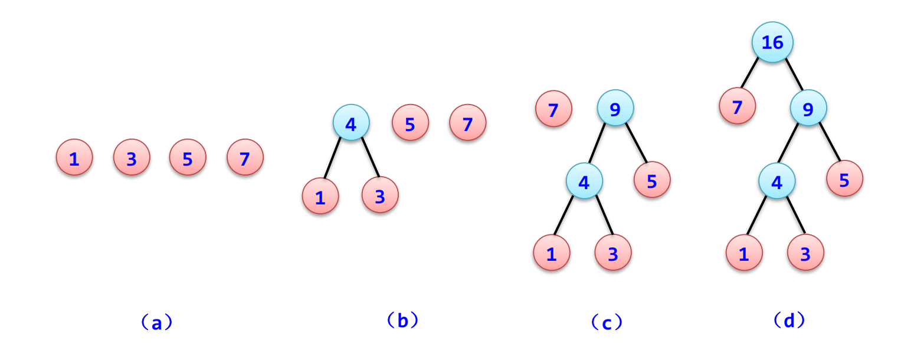

**哈夫曼编码:**

从根结点到每个叶子结点所经过的分支对应的0和1组成的序列便为该结点对应字符的编码。

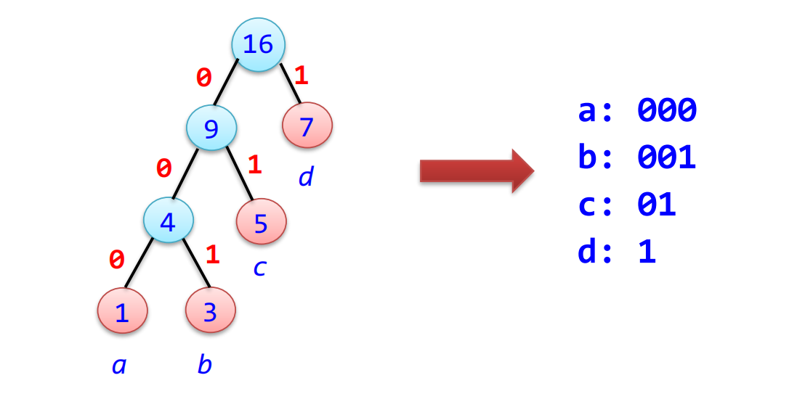

在一组字符的哈夫曼编码中，任一字符的哈夫曼编码不可能是另一字符哈夫曼编码的前缀(比如有1100就没有110)

### 一棵树到二叉树的转换

左孩子右兄弟法

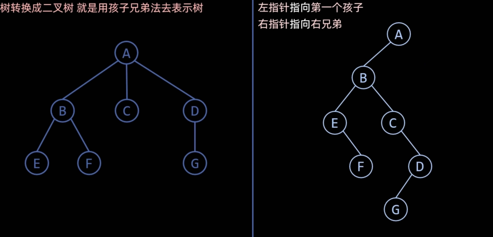

反向转换操作也只需要反过来操作即可

## 第八讲图

**性质:**

若一个图（无论有向图或无向图）中有n个顶点和e条边，每个顶点的度为$d_i$（0≤i≤n-1），则有
$$e=\frac{1}{2} \sum_{i=0}^{n-1} d_i$$

**简单路径**：若一条路径上除开始点和结束点可以相同外，其余顶点均不相同

**简单回路/简单环**：开始点与结束点相同的简单路径

**连通图**：若图G中任意两个顶点都连通

**连通分量**：无向图G中的极大连通子图。显然，任何连通图的连通分量只有一个即本身，而非连通图有多个连通分量。

**强连通图**：专门针对有向图定义的。若图G中的任意两个顶点i和j都连通，即从顶点i到顶点j和从顶点j到顶点i都存在路径

**强连通分量**：有向图G中的极大强连通子图称为G

### 图的遍历

1. DFS

**基于邻接表实现:**
```cpp
void DFS(AdjGraph& G, int v) 
{ 
    // 1. 访问起始点 v
    cout << v << " "; 
    visited[v] = 1;      // 【关键】标记 v 已访问，防止将来重复进入
    
    // 2. 获取 v 的第一个邻接点指针
    ArcNode* p = G.adjlist[v].firstarc; 
    
    // 3. 遍历 v 的所有邻接点
    while (p != NULL) 
    { 
        int w = p->adjvex; // w 是 v 的一个邻居的编号
        
        // 4. 【核心递归】如果邻居 w 还没被访问过
        if (visited[w] == 0) 
        {
            DFS(G, w);     // 递归调用：暂停当前的循环，立即去遍历 w
                           // 等 DFS(G, w) 执行完回来后，才会继续执行下一行
        }
        
        // 5. 找 v 的下一个邻居（即“回头”后的操作）
        p = p->nextarc; 
    }
}
```

**基于邻接矩阵的实现**
```cpp
void DFS(MatGraph& g, int v) 
{ 
    // 1. 访问起始点 v
    cout << v << " "; 
    visited[v] = 1;      // 标记已访问
    
    // 2. 遍历矩阵的第 v 行，寻找邻居
    for (int w = 0; w < g.n; w++) 
    { 
        // 3. 判断条件：
        // g.edges[v][w] != 0: 表示 v 和 w 之间有边（针对无权图）
        // g.edges[v][w] != INF: 表示 v 和 w 之间有边（针对带权网）
        // visited[w] == 0: 且 w 没被访问过
        if (g.edges[v][w] != 0 && g.edges[v][w] != INF && visited[w] == 0) 
        {
            // 4. 【核心递归】
            DFS(g, w);   // 递归访问邻居 w
        }
    }
}
```

2. BFS

**基于邻接表的实现:**
```cpp
void BFS(AdjGraph& G, int v) 
{ 
    // 1. 初始化
    int visited[MAXV]; 
    memset(visited, 0, sizeof(visited)); // 初始化标记数组
    queue<int> qu; // 准备一个队列
    
    // 2. 访问起点 v
    cout << v << " "; 
    visited[v] = 1; // 【关键】标记访问，入队前必须标记
    qu.push(v);     // 起点入队
    
    // 3. 队列不空，就一直循环
    while (!qu.empty()) 
    { 
        // 4. 取出队头元素 u（当前要处理的节点）
        int u = qu.front(); 
        qu.pop(); 
        
        // 5. 遍历 u 的所有邻接点（在链表中）
        ArcNode* p = G.adjlist[u].firstarc; 
        while (p != NULL) 
        { 
            int w = p->adjvex; // w 是 u 的邻居
            
            // 6. 如果邻居 w 还没被访问过
            if (visited[w] == 0) 
            {
                cout << w << " "; // 访问它
                visited[w] = 1;   // 标记已访问
                qu.push(w);       // 【关键】将新发现的节点入队，排队等待处理它的邻居
            }
            p = p->nextarc; // 继续找 u 的下一个邻居
        }
    }
}
```

**基于邻接矩阵的实现:**
```cpp
void BFS(MatGraph& g, int v) 
{ 
    // 1. 初始化（同上）
    int visited[MAXV]; 
    memset(visited, 0, sizeof(visited));
    queue<int> qu; 
    
    // 2. 访问起点（同上）
    cout << v << " "; 
    visited[v] = 1; 
    qu.push(v); 
    
    // 3. 循环处理队列
    while (!qu.empty()) 
    { 
        int u = qu.front(); 
        qu.pop(); 
        
        // 4. 【关键区别】遍历矩阵的第 u 行，寻找邻居
        for (int i = 0; i < g.n; i++) 
        {
            // g.edges[u][i] != 0: 无权图有边
            // g.edges[u][i] != INF: 带权网有边
            if (g.edges[u][i] != 0 && g.edges[u][i] != INF) 
            {
                // 5. 如果邻居 i 未被访问
                if (visited[i] == 0) 
                {
                    cout << i << " "; 
                    visited[i] = 1; 
                    qu.push(i); // 入队
                }
            }
        }
    }
}
```

### 生成树和最小生成树

**生成树**：生成树含有图中全部顶点，但只包含构成一棵树的n-1条边

由深度优先遍历得到的生成树称为深度优先生成树

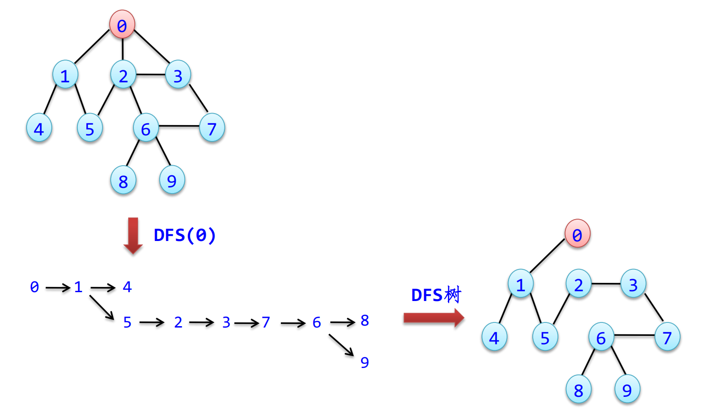

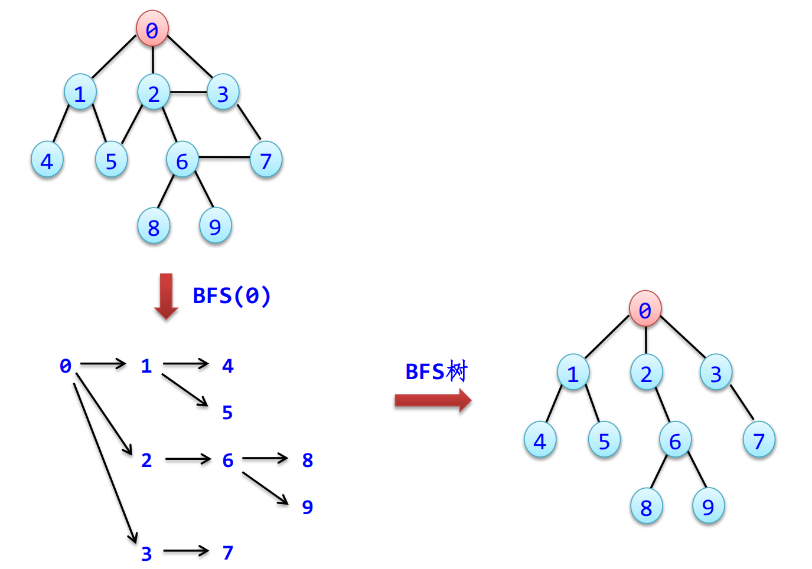

**最小生成树**：边上的权值之和最小的生成树称为图的最小生成树

**Prime算法**：又叫加点法，其实就是去看没有被“点亮”的点距离点亮的部分最近即可，然后把该点加入最小生成树并“点亮”

具体实现其实就是维护两个数组closest和lowcost，然后初始化，加点，更改数组

- closest[j]表示该最小边在U中的顶点
- lowcost[j]表示该边的权值
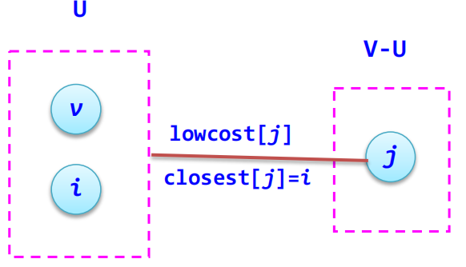

具体算法内容详见 ./图/最小生成树.cpp

**Kruskal算法**：又叫加边法，就是按边权大小对边进行排序，然后取出前n-1条边，注意用并查集检查是否在添加边的时候是否会构成环

### 最短路径算法

**Dijkstra算法**：求单源最短路问题，就是求起点到其他点的最短路径

做法：每次都选取距离起点最近的点然后更新，每次确定一个最近的点，加入路径，然后延迟出去继续更新

**Floyd算法**：多源最短路径算法，核心方法:

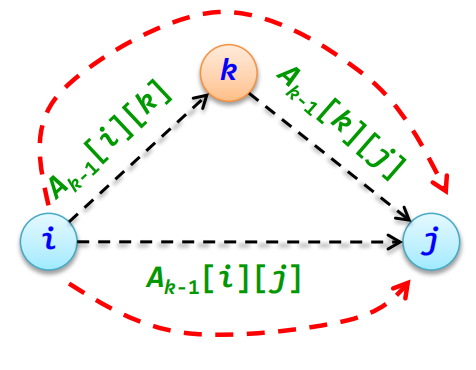

$$A_k[i][j]=\min({A_{k-1}[i][j]},{A_{k-1}[i][k]+A_{k-1}[k][j]})$$


### 拓扑排序

基本步骤如下

1. 从有向图中选择一个没有前驱（即入度为 0）的顶点并输出它
2. 从图中删去该顶点，并删除从该顶点发出的所有有向边
3. 重复上述两步，直到图中不再存在入度为 0 的顶点为止

## 第九讲查找

**平均查找长度计算方法：**
成功情况下（概率相等）的平均查找长度ASL成功是指找到T中任一记录平均需要的关键字比较次数

### 线性表查找

#### 顺序查找法

从顺序表的一端开始依次遍历，将遍历的元素关键字和给定值k相比较

#### 折半查找

设$R[0..n-1]$为递增有序顺序表

当$R[low..high]$为当前查找的区域时，令$mid=[\frac{(low + high)}{2}]$,将k与mid进行比较

1. 若$k=R[mid]$，则查找成功并返回该元素的序号$mid$
2. 若$k<R[mid]$，则在左子表$R[low..mid-1]$中查找，即下界不变，上界改为$mid-1$
3. 若$k>R[mid]$，则在右子表$R[mid+1..high]$中查找，即下界改为$mid+1$，上界不变